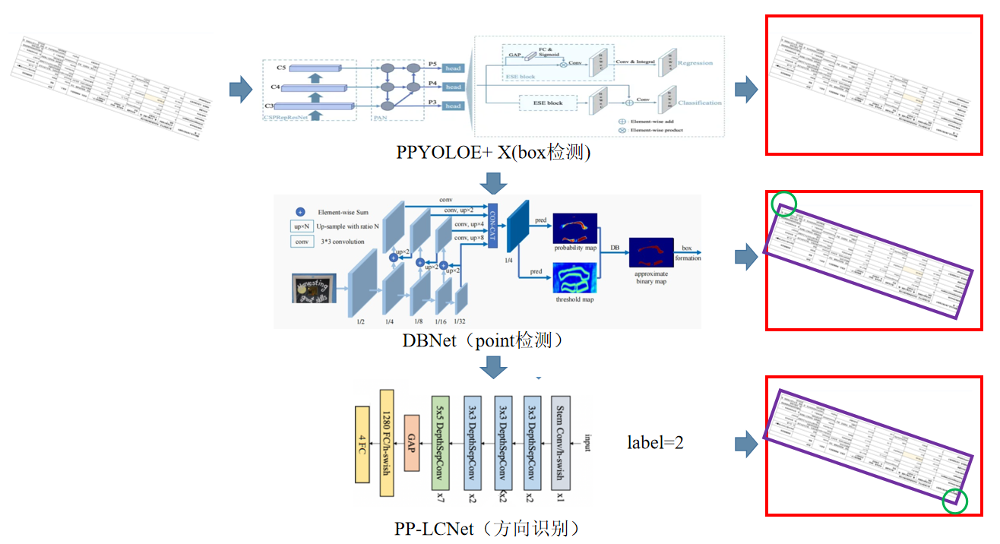

<div align="center">
  <div align="center">
    <h1><b>📊RapidTableDetection</b></h1>
  </div>
  <a href="">=3.8,<3.12-aff.svg"></a>
  <a href=""></a>
<a href="https://semver.org/"></a>
  <a href="https://github.com/psf/black"></a>
  <a href="https://github.com/RapidAI/TableStructureRec/blob/c41bbd23898cb27a957ed962b0ffee3c74dfeff1/LICENSE"></a>
</div>

### 最近更新

- **2024.10.15**
    - 完成初版代码，包含目标检测，语义分割，角点方向识别三个模块
- **2024.11.2**
    - 补充新训练yolo11的目标检测模型和边缘检测模型，增加自动下载，轻量化包体积，自由组合各个模块

### 简介

💡✨ 强大且高效的表格检测，支持论文、期刊、杂志、发票、收据、签到单等各种表格。

🚀 支持来源于paddle和yolo的版本，平衡速度和精度下单图 CPU 推理仅需 1.2 秒，onnx-GPU(V100) 最小组合仅需 0.4 秒,使用pt和paddle模型还能更快！(这个有需要后面再更新吧)

🛠️ 支持三个模块自由组合，独立训练调优，提供 ONNX 转换脚本和微调训练方案。

🌟 whl 包轻松集成使用，为下游 OCR、表格识别和数据采集提供强力支撑。

📚参考项目 [百度表格检测大赛第2名方案](https://aistudio.baidu.com/projectdetail/5398861?searchKeyword=%E8%A1%A8%E6%A0%BC%E6%A3%80%E6%B5%8B%E5%A4%A7%E8%B5%9B&searchTab=ALL)
的实现方案，补充大量真实场景数据再训练

👇🏻训练数据集在致谢, 作者天天上班摸鱼搞开源，希望大家点个⭐️支持一下

### 使用建议

📚 文档场景: 无透视旋转，只使用目标检测\
📷 拍照场景小角度旋转(-90~90): 默认左上角，不使用角点方向识别\
🔍 使用在线体验找到适合你场景的模型组合

### 在线体验

### 效果展示


### 安装

🪜模型会自动下载，也可以自己去仓库下载 [modescope模型仓](https://www.modelscope.cn/models/jockerK/TableExtractor)

``` python {linenos=table}
# 建议使用清华源安装 https://pypi.tuna.tsinghua.edu.cn/simple
pip install rapid-table-det
```

#### 参数说明

默认值
use_cuda: False : 启用gpu加速推理 \
obj_model_type="yolo_obj_det", \
edge_model_type= "yolo_edge_det", \
cls_model_type= "paddle_cls_det"

由于onnx使用gpu加速效果有限，还是建议直接使用yolox或安装paddle来执行模型会快很多(有需要我再补充整体流程)
paddle的s模型由于量化导致反而速度降低和精度降低，但是模型大小减少很多

| `model_type`         | 任务类型   | 训练来源                                 | 大小     | 单表格耗时(v100-16G,cuda12,cudnn9,ubuntu) |
|:---------------------|:-------|:-------------------------------------|:-------|:-------------------------------------|
| **yolo_obj_det**     | 表格目标检测 | `yolo11-l`                           | `100m` | `cpu:570ms, gpu:400ms`               |
| `paddle_obj_det`     | 表格目标检测 | `paddle yoloe-plus-x`                | `380m` | `cpu:1000ms, gpu:300ms`              |
| `paddle_obj_det_s`   | 表格目标检测 | `paddle yoloe-plus-x + quantization` | `95m`  | `cpu:1200ms, gpu:1000ms`             |
| **yolo_edge_det**    | 语义分割   | `yolo11-l-segment`                   | `108m` | `cpu:570ms, gpu:200ms`               |
| `yolo_edge_det_s`    | 语义分割   | `yolo11-s-segment`                   | `11m`  | `cpu:260ms, gpu:200ms`               |
| `paddle_edge_det`    | 语义分割   | `paddle-dbnet`                       | `99m`  | `cpu:1200ms, gpu:120ms`              |
| `paddle_edge_det_s`  | 语义分割   | `paddle-dbnet + quantization`        | `25m`  | `cpu:860ms, gpu:760ms`               |
| **paddle_cls_det**     | 方向分类   | `paddle pplcnet`                     | `6.5m` | `cpu:70ms, gpu:60ms`                 |


执行参数
det_accuracy=0.7,
use_obj_det=True,
use_edge_det=True,
use_cls_det=True,

### 快速使用

``` python {linenos=table}
from rapid_table_det.inference import TableDetector

img_path = f"images/weixin.png"
table_det = TableDetector()

result, elapse = table_det(img_path)
obj_det_elapse, edge_elapse, rotate_det_elapse = elapse
print(
    f"obj_det_elapse:{obj_det_elapse}, edge_elapse={edge_elapse}, rotate_det_elapse={rotate_det_elapse}"
)
# 输出可视化
# import os
# import cv2
# from rapid_table_det.utils.visuallize import img_loader, visuallize, extract_table_img
# 
# img = img_loader(img_path)
# file_name_with_ext = os.path.basename(img_path)
# file_name, file_ext = os.path.splitext(file_name_with_ext)
# out_dir = "rapid_table_det/outputs"
# if not os.path.exists(out_dir):
#     os.makedirs(out_dir)
# extract_img = img.copy()
# for i, res in enumerate(result):
#     box = res["box"]
#     lt, rt, rb, lb = res["lt"], res["rt"], res["rb"], res["lb"]
#     # 带识别框和左上角方向位置
#     img = visuallize(img, box, lt, rt, rb, lb)
#     # 透视变换提取表格图片
#     wrapped_img = extract_table_img(extract_img.copy(), lt, rt, rb, lb)
#     cv2.imwrite(f"{out_dir}/{file_name}-extract-{i}.jpg", wrapped_img)
# cv2.imwrite(f"{out_dir}/{file_name}-visualize.jpg", img)

```

## FAQ (Frequently Asked Questions)

1. **问：如何微调模型适应特定场景?**
   - 答：直接参考这个项目，有非常详细的可视化操作步骤,数据集也在里面，可以得到paddle的推理模型 [百度表格检测大赛](https://aistudio.baidu.com/projectdetail/5398861?searchKeyword=%E8%A1%A8%E6%A0%BC%E6%A3%80%E6%B5%8B%E5%A4%A7%E8%B5%9B&searchTab=ALL),
   - yolo11的训练使用官方脚本足够简单，按官方指导转换为coco格式训练即可
2. **问：如何导出onnx**
    - 答：paddle模型需要在本项目tools下，有onnx_transform.ipynb文件
      yolo11的话，直接参照官方的方式一行搞定  
3. **问：图片有扭曲可以修正吗？**
    - 答：本项目只解决旋转和透视场景的表格提取，对于扭曲的场景，需要先进行扭曲修正

### 致谢

[百度表格检测大赛第2名方案](https://aistudio.baidu.com/projectdetail/5398861?searchKeyword=%E8%A1%A8%E6%A0%BC%E6%A3%80%E6%B5%8B%E5%A4%A7%E8%B5%9B&searchTab=ALL) \
[WTW 自然场景表格数据集](https://tianchi.aliyun.com/dataset/108587) \
[FinTabNet PDF文档表格数据集](https://developer.ibm.com/exchanges/data/all/fintabnet/) \
[TableBank 表格数据集](https://doc-analysis.github.io/tablebank-page/) \
[TableGeneration 表格自动生成工具](https://github.com/WenmuZhou/TableGeneration)

### 贡献指南

欢迎提交请求。对于重大更改，请先打开issue讨论您想要改变的内容。

有其他的好建议和集成场景，作者也会积极响应支持

### 开源许可证

该项目采用[Apache 2.0](https://github.com/RapidAI/TableStructureRec/blob/c41bbd23898cb27a957ed962b0ffee3c74dfeff1/LICENSE)
开源许可证。

