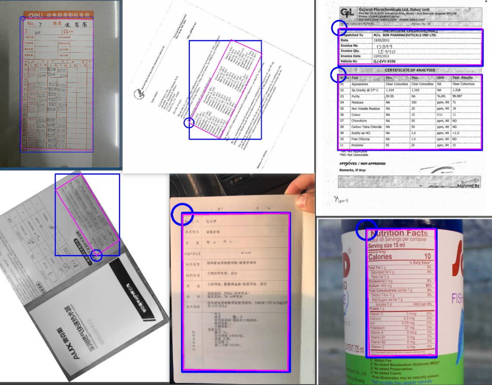
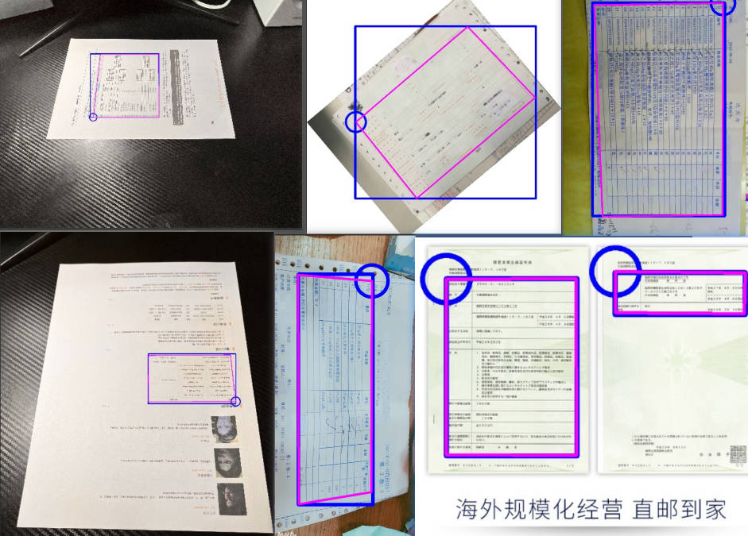

<div align="center">
  <div align="center">
    <h1><b>📊 表格结构识别</b></h1>
  </div>
  <a href="">=3.8,<3.12-aff.svg"></a>
  <a href=""></a>
<a href="https://semver.org/"></a>
  <a href="https://github.com/psf/black"></a>
  <a href="https://github.com/RapidAI/TableStructureRec/blob/c41bbd23898cb27a957ed962b0ffee3c74dfeff1/LICENSE"></a>
</div>

### 最近更新
- **2024.10.15**
    - 完成初版代码，包含目标检测，语义分割，角点方向识别三个模块

### 简介
复杂场景下的表格提取方案，同时支持高精度的paddle推理和量化小模型的onnx推理
采用项目[百度表格检测大赛](https://aistudio.baidu.com/projectdetail/5398861?searchKeyword=%E8%A1%A8%E6%A0%BC%E6%A3%80%E6%B5%8B%E5%A4%A7%E8%B5%9B&searchTab=ALL)的实现方案，补充大量真实场景数据再训练


#### 特点

- ⚡ 论文，期刊，杂志等多表格场景
- ⚡ 发票，收据，签到单等复杂背景
- ⚡ 旋转任意角度+透视修正
- ⚡ 面向不同场景，三个模型自由组合
- ⚡ cpu/gpu 支持，单图推理2s以内
### 效果展示

### 快速使用
#### cpu 场景
``` python {linenos=table}
import os

import cv2

from rapid_table_det.inference import TableDetector
from rapid_table_det.utils import visuallize, extract_table_img, img_loader
#paddle-gpu 版本修改引入包
#from rapid_table_det_paddle.inference import TableDetector
#from rapid_table_det_paddle.utils import visuallize, extract_table_img

img_path = f"../images/WechatIMG147.jpeg"
file_name_with_ext = os.path.basename(img_path)
file_name, file_ext = os.path.splitext(file_name_with_ext)
out_dir = "outputs"
if not os.path.exists(out_dir):
    os.makedirs(out_dir)
# gpu 版本如果存在
# models/obj_det/model.pdiparams
# models/obj_det/model.pdmodel,
# 则路径为models/obj_det/model  
table_det = TableDetector(
    obj_model_path="models/obj_det.onnx",
    edge_model_path="models/edge_det.onnx",
    cls_model_path="models/cls_det.onnx",
    # 简单背景只有单表格，可以不使用
    use_obj_det=True,
    # 无透视旋转，可以不使用 
    use_edge_det=True,
    # 只有小角度(-90 ~ 90)旋转场景，可以不使用 
    use_rotate_det=True) 
result, elapse = table_det(img_path)
obj_det_elapse, edge_elapse, rotate_det_elapse = elapse
print(f"obj_det_elapse:{obj_det_elapse}, edge_elapse={edge_elapse}, rotate_det_elapse={rotate_det_elapse}")
# 一张图片中可能有多个表格
img = img_loader(img_path)
for i, res in enumerate(result):
    box = res["box"]
    lt, rt, rb, lb = res["lt"], res["rt"], res["rb"], res["lb"]
    # 带识别框和左上角方向位置
    img = visuallize(img, box, lt, rt, rb, lb)
    # 透视变换提取表格图片
    extract_img = extract_table_img(img.copy(), lt, rt, rb, lb)
    cv2.imwrite(f"{out_dir}/{file_name}-extract-{i}.jpg", extract_img)
cv2.imwrite(f"{out_dir}/{file_name}-visualize.jpg", img)
```

### TODO List

### 致谢
[百度表格检测大赛](https://aistudio.baidu.com/projectdetail/5398861?searchKeyword=%E8%A1%A8%E6%A0%BC%E6%A3%80%E6%B5%8B%E5%A4%A7%E8%B5%9B&searchTab=ALL)

### 贡献指南

欢迎提交请求。对于重大更改，请先打开issue讨论您想要改变的内容。

请确保适当更新测试。

### 开源许可证

该项目采用[Apache 2.0](https://github.com/RapidAI/TableStructureRec/blob/c41bbd23898cb27a957ed962b0ffee3c74dfeff1/LICENSE)
开源许可证。

